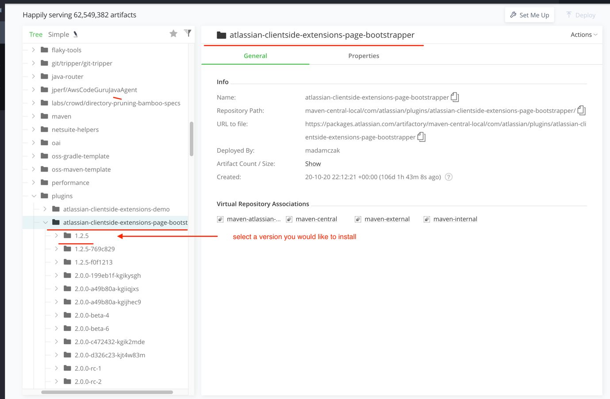
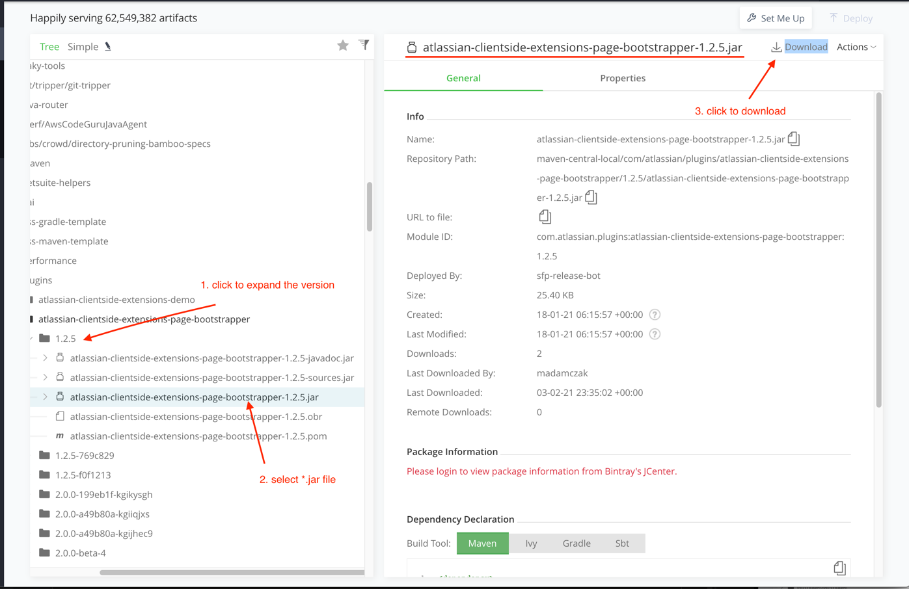
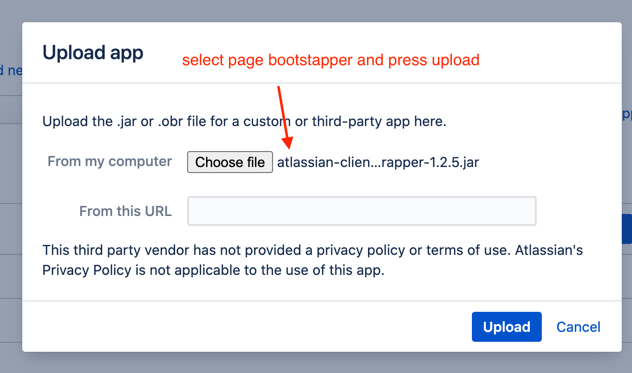
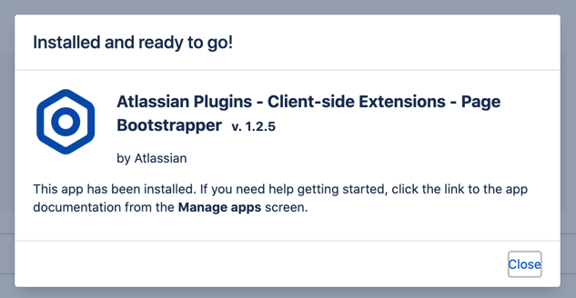

# Bitbucket Server 7.0+ Plugin Template

Bitbucket Server [Client-side Extension](https://developer.atlassian.com/server/framework/clientside-extensions/) template powered by JavaScript, Webpack, React, and [Atlaskit](https://atlaskit.atlassian.com/).

## Requirements

-   **Node** 12.13.0 (you can use nvm)
-   **Maven** 3.6.2
-   **Java JDK** 1.8
-   [**Atlassian SDK 8**](https://developer.atlassian.com/server/framework/atlassian-sdk/downloads/)

## Bitbucket

This template includes the **Bitbucket** version `7.11.1` and it's using **Client-Side Extensions** version `2.2.0`.

## Starting Bitbucket

To start Bitbucket, first install all the maven dependencies:

```sh
atlas-package -DskipTests
```

Next, run this command to start Bitbucket:

```sh
atlas-run -DskipTests
```

## Developing the plugin

In the project directory, you can run:

### `npm start`

It builds the frontend and puts it in the watch mode with hot reload.
In other words, if you have the whole plugin, and an instance already working,
this will enable you to make quick changes with an instant preview.

## Using a template to build your plugin

By default, this template has a few pre-defined plugin keys that should be unique for every plugin.

To build your plugin you should rename the **group id**, **artifact id** and the **plugin key** values:

-   artifact id: `bitbucket-plugin-template`
-   group id: `com.atlassian.myapp`
-   plugin key: `com.atlassian.myapp.bitbucket-plugin-template`

You should find and replace those values in all the files:

-   `config/webpack.constants.js` - `PLUGIN_KEY` const
-   `pom.xml` - `groupId` and `artifactId` tags
-   `package.json` - `name` field

## Building plugin

To create a plugin binary that can be installed on a standalone Bitbucket instance or published the marketplace,
you will have to use the `atlas-package` command:

```sh
atlas-package
```

This command will create a `*.jar` and `*.obr` binary files under the `target` directory.

### Running plugin

This plugin template is using the [`page-bootstrapper` plugin](https://developer.atlassian.com/server/framework/clientside-extensions/guides/how-to/setup-page-bootstrapper/).

To run the distribution version of the plugin on a standalone Bitbucket you will have to provide the `page-bootstrapper` package. The generated `*.obr` file inside `target` will include the required dependency.

If you install the plugin from the `*.jar` package, then you need to manually upload the required `page-bootstrapper` dependency to your Bitbucket instance:

1. Go to the [maven registry](https://packages.atlassian.com/ui/repos/tree/General/maven-central-local%2Fcom%2Fatlassian%2Fplugins%2Fatlassian-clientside-extensions-page-bootstrapper)
   and find the version of `atlassian-clientside-page-bootstrapper` you would like to install.

    

2. Expand the version and find the `*.jar` file, then click `Download` link

    

3. Login into Administration panel of Bitbucket, go to `Mange Apps`, and press `Upload` button.

4. Inside the modal select the downloaded `atlassian-clientside-page-bootstrapper.jar` file and press upload

    

5. Wait for the package to be installed and enabled

    

### Troubleshooting

### Missing requirement

In case you see the error in Bitbucket logs similar to this:

```
Unable to resolve com.atlassian.myapp.bitbucket-plugin-template: missing requirement [com.atlassian.myapp.bitbucket-plugin-template osgi.wiring.package; (&(osgi.wiring.package=com.atlassian.plugin.clientsideextensions)(version>=1.2.3))
Unresolved requirements: [[com.atlassian.myapp.bitbucket-plugin-template osgi.wiring.package; (&(osgi.wiring.package=com.atlassian.plugin.clientsideextensions)(version>=1.2.3))]
```

This means you need to install the missing `page-bootstrapper` package. Check the **Running plugin** or the **Removing page-bootstrapper** sections for more details.

### Other problems

In you have any other issues related to CSE check the [Debugging and troubleshooting an extension](https://developer.atlassian.com/server/framework/clientside-extensions/guides/how-to/debugging-and-troubleshooting-an-extension/) guide.

### Removing page-bootstrapper

If you don't plan to use the [`PageExtension`](https://developer.atlassian.com/server/framework/clientside-extensions/reference/api/extension-factories/page/) you can remove the `page-bootstrapper` dependency from the project:

1. Update the `pom.xml` file.

    ```patch
    diff --git a/pom.xml b/pom.xml
    --- a/pom.xml
    +++ b/pom.xml
    @@ -123,12 +123,6 @@
                 <artifactId>gson</artifactId>
                 <version>${gson.libversion}</version>
             </dependency>
    -        <!-- Page bootstrapper dependencies -->
    -        <dependency>
    -            <groupId>com.atlassian.plugins</groupId>
    -            <artifactId>atlassian-clientside-extensions-page-bootstrapper</artifactId>
    -            <version>${cse.version}</version>
    -        </dependency>
         </dependencies>

         <build>
    @@ -152,13 +146,6 @@
                                 <dataVersion>${bitbucket.data.version}</dataVersion>
                             </product>
                         </products>
    -                    <!-- https://developer.atlassian.com/server/framework/atlassian-sdk/bundling-extra-dependencies-in-an-obr/ -->
    -                    <pluginDependencies>
    -                        <pluginDependency>
    -                            <groupId>com.atlassian.plugins</groupId>
    -                            <artifactId>atlassian-clientside-extensions-page-bootstrapper</artifactId>
    -                        </pluginDependency>
    -                    </pluginDependencies>
                         <!-- Needed to include the bootstrapper when starting the project with AMPS -->
                         <pluginArtifacts>
                             <pluginArtifact>
    @@ -171,10 +158,6 @@
                             <Atlassian-Plugin-Key>${atlassian.plugin.key}</Atlassian-Plugin-Key>
                             <Atlassian-Scan-Folders>META-INF/plugin-descriptors</Atlassian-Scan-Folders>
                             <Import-Package>
    -                            <!-- https://developer.atlassian.com/server/framework/atlassian-sdk/bundling-extra-dependencies-in-an-obr/ -->
    -                            <!-- The "com.atlassian.plugin.clientsideextensions" import is required by the page-bootstrapper package.
    -                            If you don't need it, you can remove this line. -->
    -                            com.atlassian.plugin.clientsideextensions;version="${cse.version}",
                                 com.atlassian.plugin.osgi.bridge.external,
                                 *
                             </Import-Package>
    ```

2. Delete the example extensions that are using `PageExtension` API:
    ```
    rm -r src/main/my-app/extensions/pages
    ```

If you do that, you can skip manually installing the `atlassian-clientside-page-bootstrapper.jar` plugin mentioned in the previous step.

## Links

-   [https://developer.atlassian.com/server/framework/atlassian-sdk/atlas-help](https://developer.atlassian.com/server/framework/atlassian-sdk/atlas-help)

    Documentation for all the `atlas-*` CLI commands

-   [https://developer.atlassian.com/server/framework/clientside-extensions/](https://developer.atlassian.com/server/framework/clientside-extensions/)

    Documentation for Client-Side Extensions

## Issues

If you have any issues related to Client-Side Extensions, please [report them here](https://ecosystem.atlassian.net/browse/CSE).
